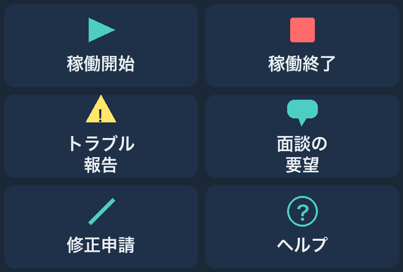
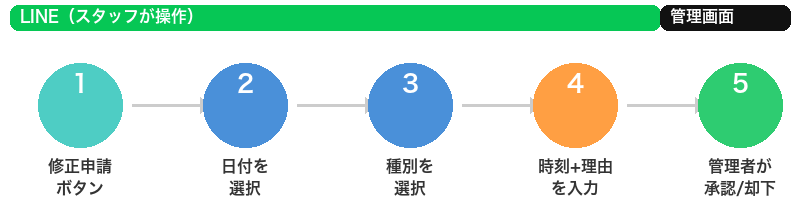
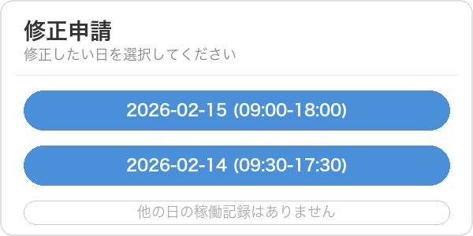
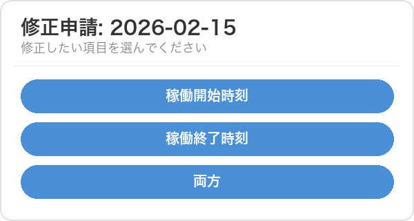
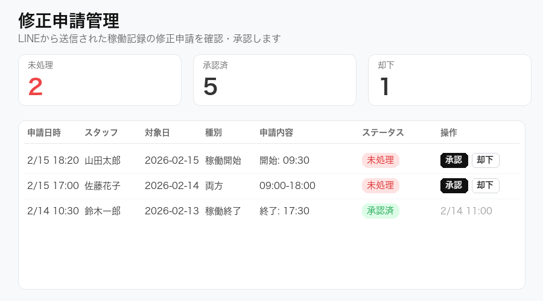

# LINE機能がアップデートされました

**2026年2月16日**

こんにちは。Re:nk運営チームです。

いつもRe:nk OSをご利用いただきありがとうございます。
このたび、LINEの機能が大きくパワーアップしました。

この記事では、**何が変わったのか**と**使い方**を、画面の写真つきでわかりやすくご説明します。

---

## 今回のアップデートで変わったこと（3つ）

1. **ボタンの名前が変わりました**（「出勤」→「稼働開始」、「退勤」→「稼働終了」）
2. **メニューボタンが6つに増えました**（修正申請・面談の要望が追加）
3. **稼働記録の修正がLINEからできるようになりました**（新機能）

---

## 1. ボタンの名前が変わりました

業務委託でお仕事をされている皆さんにとって、より適切な表現に変更しました。

| 変更前 | 変更後 |
|--------|--------|
| 出勤報告 | **稼働開始** |
| 退勤報告 | **稼働終了** |

操作方法はこれまでと全く同じです。ボタンの名前が変わっただけなので、そのまま使ってください。

---

## 2. メニューボタンが6つに増えました

LINEのトーク画面の下に表示されるメニューが、新しいデザインになりました。

### ボタンの説明

| ボタン | 何ができる？ |
|--------|------------|
| **稼働開始** | お仕事の開始を記録します（以前の「出勤報告」と同じです） |
| **稼働終了** | お仕事の終了を記録します（以前の「退勤報告」と同じです） |
| **トラブル報告** | 現場で困ったことがあったとき、すぐに報告できます |
| **面談の要望** | 担当者との面談を希望するとき、ワンタップで伝えられます |
| **修正申請** | 稼働記録の押し忘れ・間違いを修正できます（**新機能**） |
| **ヘルプ** | 使い方がわからないときの案内を表示します |

> メニューが表示されない場合は、トーク画面の下のキーボードアイコンの隣にあるメニューアイコンをタップしてください。

---

## 3. 【新機能】稼働記録の修正がLINEからできるようになりました

**「稼働開始のボタンを押し忘れた！」**
**「稼働終了の時刻を間違えた！」**

...こんなとき、今までは担当者に連絡して修正してもらう必要がありました。

これからは、**LINEから自分で修正の申請ができます。**
申請は管理者が確認して承認すると、自動で記録が修正されます。

---

### 修正申請のやり方（5ステップ）

全体の流れはこのようになっています。

スマホでの操作はステップ1～4だけ。あとは管理者が対応します。

---

#### ステップ1: 「修正申請」ボタンをタップ

LINEのメニューから「修正申請」ボタンをタップしてください。

---

#### ステップ2: 修正したい日を選ぶ

直近7日間の稼働記録が一覧で表示されます。
修正したい日のボタンをタップしてください。

> 各ボタンには日付と稼働時間が表示されるので、どの日を修正したいか一目でわかります。

---

#### ステップ3: 修正の種類を選ぶ

どの時刻を修正したいかを選びます。

| 選択肢 | いつ使う？ |
|--------|-----------|
| **稼働開始時刻** | 開始の時刻だけ直したいとき |
| **稼働終了時刻** | 終了の時刻だけ直したいとき |
| **両方** | 開始と終了の両方を直したいとき |

---

#### ステップ4: 正しい時刻と理由を入力

修正後の正しい時刻と、修正の理由をテキストで入力して送信してください。

**入力の例：**

- 「9:30 電車遅延で打刻が遅れたため」
- 「18:00 終了ボタンを押し忘れました」
- 「9:00-18:30 開始・終了ともに押し忘れ」

> 時刻は「9:30」や「18:00」のように、数字とコロンで入力してください。

---

#### ステップ5: 管理者が承認

申請が送信されると、管理者に通知が届きます。
管理者が管理画面で内容を確認し、承認または却下します。

**承認されると：**
- 稼働記録が自動で修正されます
- LINEに「承認されました」という通知が届きます

**却下された場合：**
- LINEに「却下されました」という通知と理由が届きます
- 内容を修正して、もう一度申請できます

---

## よくある質問

### Q. 修正申請できる期間は？
**A.** 直近7日間の稼働記録が対象です。それより前の記録は担当者にご連絡ください。

### Q. 何回まで申請できますか？
**A.** 1日あたり5件まで申請できます。

### Q. 申請してからどのくらいで反映されますか？
**A.** 管理者が承認した時点ですぐに反映されます。承認のタイミングは管理者の対応状況によります。

### Q. 間違って申請してしまった場合は？
**A.** 管理者が却下できますので、担当者にその旨お伝えください。

### Q. メニューが以前のまま（2ボタン）です
**A.** LINEアプリを一度閉じて、再度開いてみてください。それでも変わらない場合は、担当者にご連絡ください。

---

## まとめ

| 機能 | できること |
|------|----------|
| **稼働開始/稼働終了** | お仕事の開始・終了を記録（名前が変わっただけで使い方は同じ） |
| **トラブル報告** | 現場の困りごとをすぐ報告 |
| **面談の要望** | 担当者との面談をリクエスト |
| **修正申請（新機能）** | 稼働記録の押し忘れ・間違いをLINEから修正 |
| **ヘルプ** | 使い方の確認 |

**稼働記録の押し忘れでお困りの方は、ぜひ「修正申請」機能をお試しください。**

ご不明な点があれば、いつでも担当者またはLINEの「ヘルプ」ボタンからお問い合わせください。

---

*Re:nk運営チーム*
