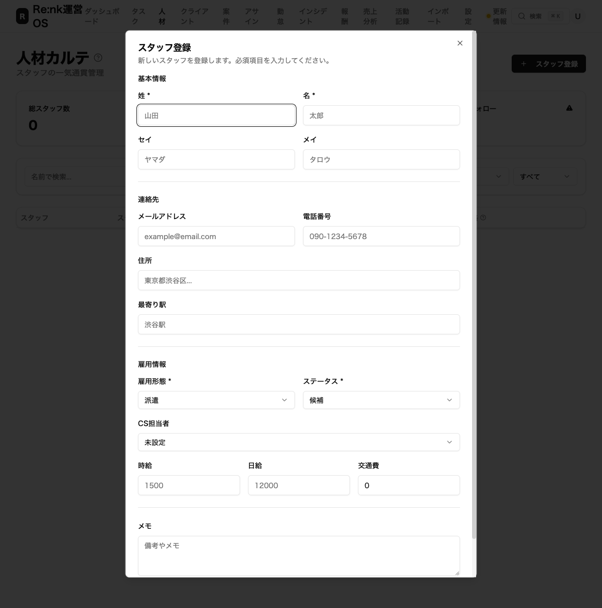
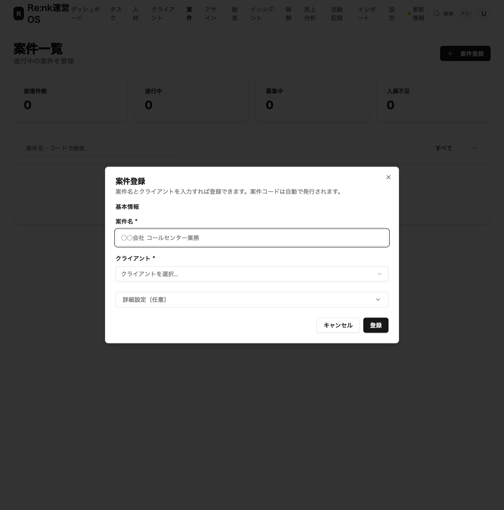
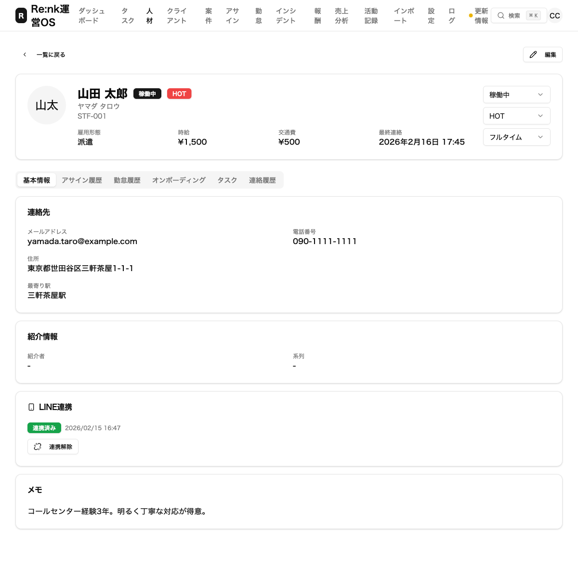
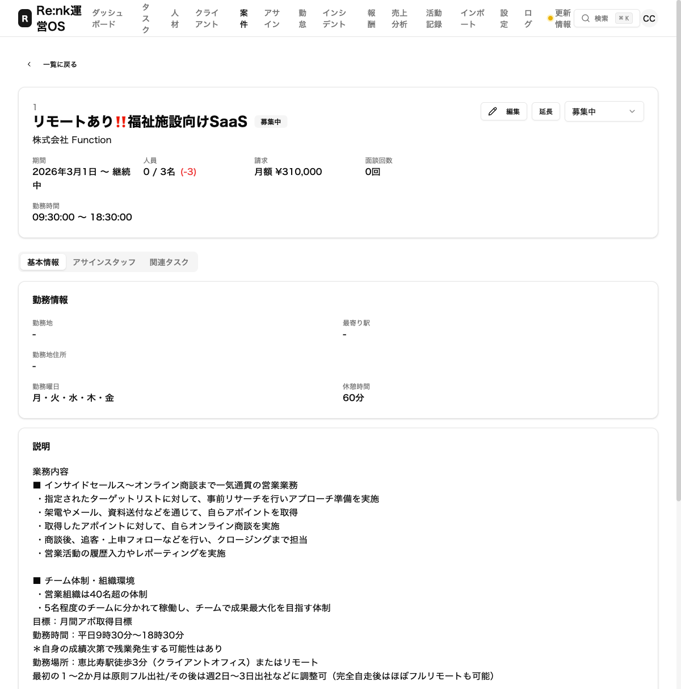
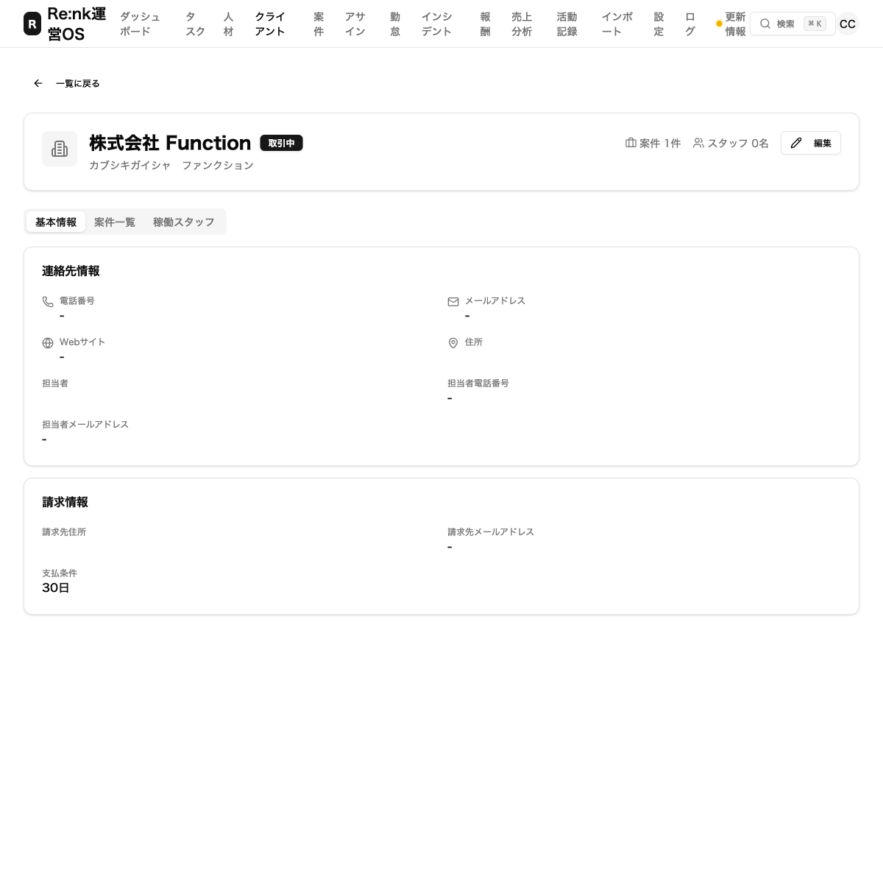

# 浦野くんのフィードバック5件を改善しました

**2026年2月16日**

こんにちは。Re:nk運営チームです。

スタッフの浦野くんから「ここが使いにくい」「こうしてほしい」という貴重なご意見を5つもらいました。
今回、その**すべてに対応**しましたので、何がどう変わったのかを画面の写真つきでお伝えします。

---

## 改善した5つのポイント

| # | 改善内容 | ひとことで言うと |
|---|---------|---------------|
| 1 | スタッフ登録のかんたん化 | コード入力が不要になった |
| 2 | 案件登録のかんたん化 | 2つ入力するだけで登録できるようになった |
| 3 | スタッフの情報を編集できるようになった | 編集ボタンと稼働区分の追加 |
| 4 | 案件の情報を編集できるようになった | 編集ボタンの追加 |
| 5 | クライアントの情報を編集できるようになった | 編集ボタンの追加 |

---

## 1. スタッフ登録がかんたんになりました

### 何が変わった？

以前は「スタッフコード」（STF-001 のような番号）を自分で考えて入力する必要がありました。
**これからは、番号はシステムが自動でつけてくれます。** 入力欄自体がなくなりました。

また、**「CS担当者」を選べる欄**が新しく追加されました。
誰がそのスタッフを担当するのかを、登録時に設定できます。

### 改善後の画面

> ポイント：「スタッフコード」の入力欄がなくなり、代わりに「CS担当者」を選べるようになりました。名前や連絡先など必要な情報を入れるだけで、すぐに登録できます。

---

## 2. 案件登録がかんたんになりました

### 何が変わった？

以前は案件を登録するとき、たくさんの入力欄が一度に表示されていました。
「何を入れたらいいかわからない」という声がありました。

**今は「案件名」と「クライアント」の2つだけ入力すれば登録できます。**

細かい設定（勤務時間、報酬、業務内容など）は「詳細設定」という折りたたみの中にまとめました。
必要なときだけ開いて入力できます。

### 改善後の画面

> ポイント：入力欄がたったの2つ。「詳細設定（任意）」をタップすると、追加の設定が開きます。まずは最低限の情報で素早く登録して、あとから細かい設定を追加する使い方ができます。

---

## 3. スタッフ詳細ページに編集ボタン＋稼働区分を追加しました

### 何が変わった？

これまで、スタッフの情報を登録したあとに「間違えた！」と思っても、修正する方法がありませんでした。

**右上に「編集」ボタンが追加され、情報をあとから直せるようになりました。**

さらに、**「稼働区分」**を選べるようになりました。
「フルタイム」か「スポット」か、スタッフの働き方をワンタップで設定できます。

### 改善後の画面

> ポイント：右上に「✏️ 編集」ボタンが追加されました。また、右側に「フルタイム」「スポット」を切り替えるメニューがあります。スタッフの状態、HOT度、稼働区分の3つがひと目で管理できます。

---

## 4. 案件詳細ページに編集ボタンを追加しました

### 何が変わった？

案件の情報も、登録後に修正できるようになりました。
**タイトルの横に「編集」ボタンが表示されます。**

### 改善後の画面

> ポイント：案件名の右に「編集」ボタンが追加されました。案件名、期間、報酬など、あとからいつでも修正できます。

---

## 5. クライアント詳細ページに編集ボタンを追加しました

### 何が変わった？

クライアント（取引先）の情報も同様に、あとから編集できるようになりました。
**会社名の横に「編集」ボタンが表示されます。**

### 改善後の画面

> ポイント：「株式会社 Function」の右側に「✏️ 編集」ボタンが追加されました。電話番号、住所、担当者情報など、いつでも更新できます。

---

## まとめ

| # | 改善内容 | 状態 |
|---|---------|------|
| 1 | スタッフ登録 → コード自動採番 ＋ CS担当者の追加 | ✅ 完了 |
| 2 | 案件登録 → 2項目だけで登録可能に | ✅ 完了 |
| 3 | スタッフ詳細 → 編集ボタン ＋ 稼働区分（フルタイム/スポット） | ✅ 完了 |
| 4 | 案件詳細 → 編集ボタン追加 | ✅ 完了 |
| 5 | クライアント詳細 → 編集ボタン追加 | ✅ 完了 |

**5件すべて対応完了し、本番環境に反映済みです。**

今後も「使いにくい」と感じるところがあれば、遠慮なく教えてください。
どんどん改善していきます！

---

*Re:nk運営チーム*
