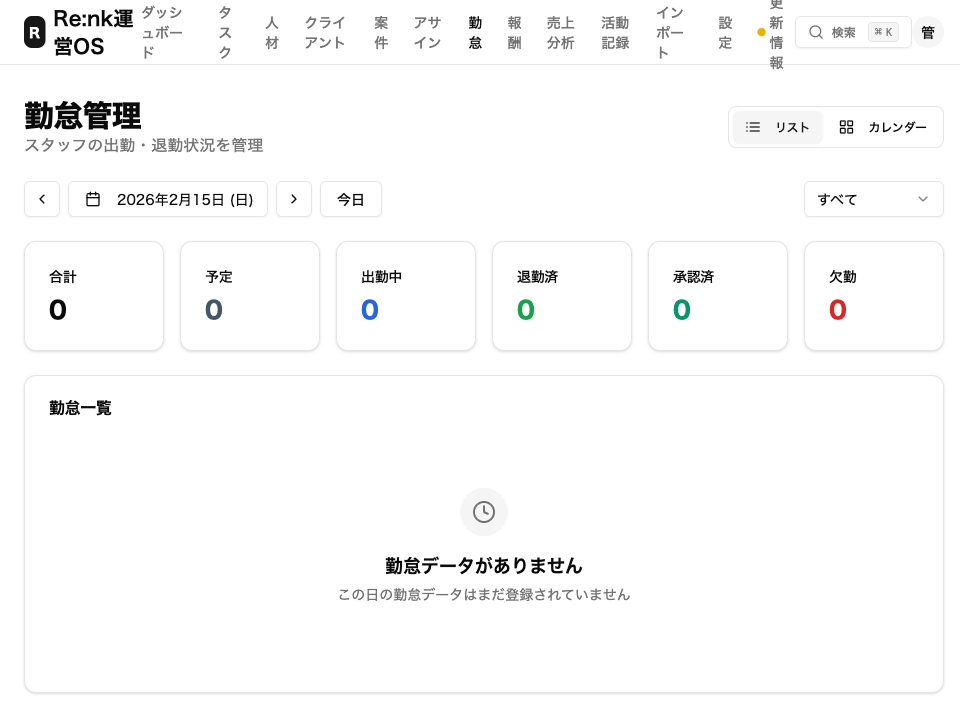
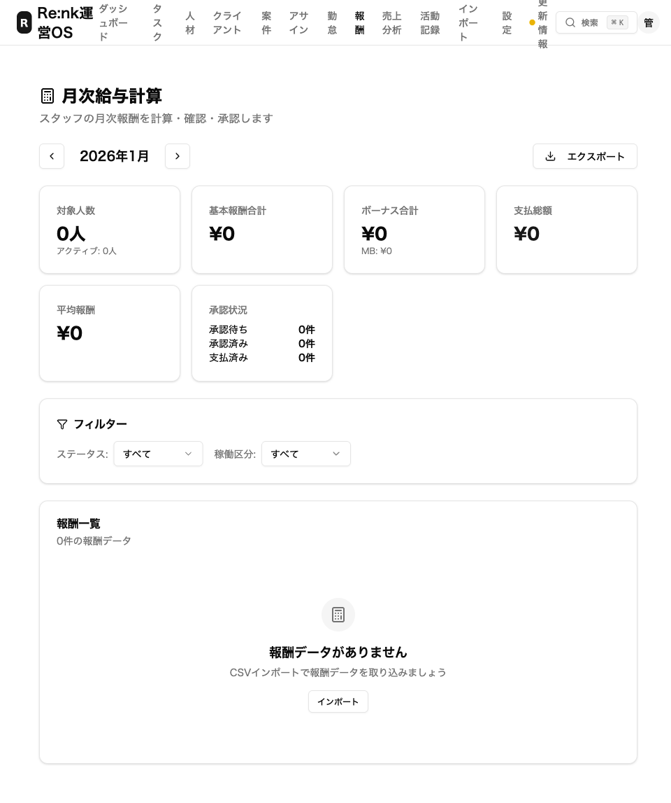
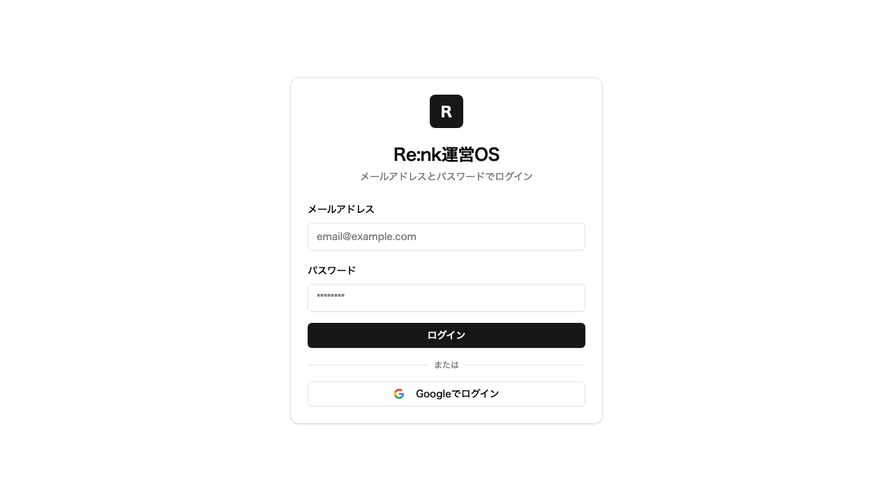
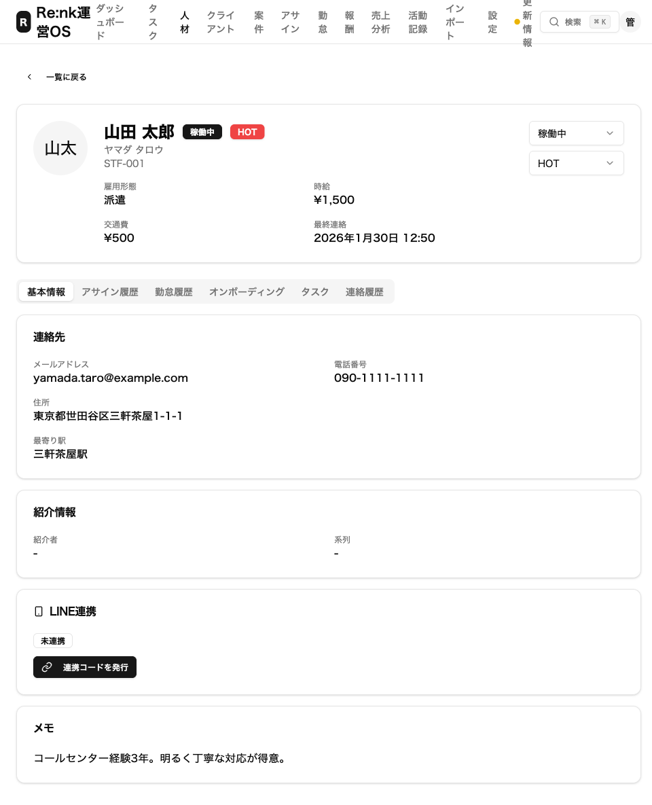

# 高野さん・齋藤さんの要望にすべて対応しました

**2026年2月18日**

こんにちは。Re:nk運営チームです。

高野さんと齋藤さんから頂いた貴重なご意見・ご要望に、**すべて対応**しました。
この記事では、どんな要望があって、それぞれ何がどう変わったのかを、写真つきでわかりやすくお伝えします。

---

## 対応した内容の一覧

### 高野さんの要望（7件）

| # | 要望 | 対応内容 |
|---|------|---------|
| 1 | シフトの管理をしたい | カレンダー形式のシフト管理ページを追加 |
| 2 | シフトの前日にLINEでリマインドしてほしい | 自動通知の仕組みを追加 |
| 3 | 退職したスタッフの紹介料を自動で止めてほしい | 退職処理で自動停止する仕組みを追加 |
| 4 | 請求書の金額を自動で計算してほしい | 月次報酬の自動集計ページを追加 |
| 5 | 現場の地図をスタッフに送りたい | Googleマップ付きの現場案内を追加 |
| 6 | スマホでもアプリみたいに使いたい | ホーム画面に追加できるアプリ対応（PWA）を実装 |
| 7 | 初めての人にも使い方がわかるようにしてほしい | ヘルプ画面とガイドを追加 |

### 齋藤さんのフィードバック（6件）

| # | フィードバック | 対応内容 |
|---|-------------|---------|
| 1 | 「時給」「出勤」など雇用っぽい言葉を直してほしい | 全画面の用語を業務委託向けに統一 |
| 2 | スタッフと案件を紐づけたい（双方向で） | 両方の画面から紐づけ・編集・削除できるように |
| 3 | 紐づけ時に単価を毎回入力するのが面倒 | スタッフを選ぶと単価が自動で入るように |
| 4 | 常駐なのかスポットなのか区別したい | 「常駐」「スポット」の選択と表示を追加 |
| 5 | 移動経費をLINEから申請したい | LINEに「経費申請」ボタンを追加 |
| 6 | シフトの確認を忘れるスタッフに通知してほしい | 毎朝自動でLINE通知する仕組みを追加 |

---

## 高野さんの要望 — 詳しい説明

---

### 1. シフトの管理をしたい

#### どんな要望？
「いつ誰がどの現場に入るか、カレンダーで見たい」という要望です。

#### どう対応した？
カレンダー形式のシフト管理ページを作りました。
月ごとにスタッフの出勤予定を一覧で見られます。シフトの追加・編集・削除もこの画面からできます。

> ポイント：カレンダー上でスタッフの名前と勤務予定が一目で確認できます。予定の変更もクリック（タップ）するだけです。

---

### 2. シフトの前日にLINEでリマインドしてほしい

#### どんな要望？
「スタッフがシフトを確認し忘れて、当日慌てることがある。前日にLINEで通知してほしい」という要望です。

#### どう対応した？
案件ごとに「何日前に通知するか」を設定できるようにしました。
毎朝9時に自動でチェックして、まだシフトを確認していないスタッフにLINEで通知します。

> ポイント：案件の設定画面で「シフト日の ○ 日前に通知」と設定するだけ。あとはシステムが毎朝自動で通知してくれます。0にすると通知なしにもできます。

---

### 3. 退職したスタッフの紹介料を自動で止めてほしい

#### どんな要望？
「スタッフが退職したのに紹介料の計算がそのまま残っていて、手作業で止めるのが手間」という要望です。

#### どう対応した？
スタッフのステータスを「退職」に変更すると、紹介料の計算が自動で停止するようにしました。

> ポイント：退職処理をすれば、あとは自動。手作業での対応は不要になりました。

---

### 4. 請求書の金額を自動で計算してほしい

#### どんな要望？
「毎月の報酬額をExcelで手計算するのが大変」という要望です。

#### どう対応した？
月次報酬の自動集計ページを追加しました。スタッフごとの稼働実績をもとに、報酬額が自動で計算されます。

> ポイント：期間を指定すると、各スタッフの稼働時間・報酬額が自動計算されます。集計結果はそのまま帳票として使えます。

---

### 5. 現場の地図をスタッフに送りたい

#### どんな要望？
「初めての現場に行くスタッフに、地図を送れるようにしてほしい」という要望です。

#### どう対応した？
案件の詳細にGoogleマップの住所情報を登録できるようにしました。スタッフへの案内にそのまま使えます。

> ポイント：案件登録時に住所を入力しておけば、Googleマップのリンクが自動で生成されます。

---

### 6. スマホでもアプリみたいに使いたい

#### どんな要望？
「管理画面をスマホで使うとき、毎回ブラウザを開いてURLを入れるのが面倒」という要望です。

#### どう対応した？
PWA（ホーム画面に追加できるWebアプリ）に対応しました。スマホのホーム画面にアイコンを追加すると、アプリのように使えます。

> ポイント：iPhoneなら「共有」→「ホーム画面に追加」、Androidなら「メニュー」→「ホーム画面に追加」で、アプリのように使えるようになります。

---

### 7. 初めての人にも使い方がわかるようにしてほしい

#### どんな要望？
「管理画面に初めてログインしたとき、何をすればいいかわからない」という要望です。

#### どう対応した？
ヘルプページと使い方ガイドを追加しました。画面上部のメニューから「ヘルプ」をクリックすると、基本的な操作方法が確認できます。

> ポイント：「何から始めればいい？」に答えるガイドを用意しました。困ったときはいつでも参照できます。

---

## 齋藤さんのフィードバック — 詳しい説明

---

### 1. 「時給」「出勤」など雇用っぽい言葉を直してほしい

#### どんなフィードバック？
「業務委託なのに "時給" や "出勤" という言葉が使われていると、法律的に問題になるかもしれない」というフィードバックです。

#### どう対応した？
画面に表示されるすべての言葉を、業務委託にふさわしい表現に変更しました。

| 変更前 | 変更後 |
|--------|--------|
| 時給 | **時間単価** |
| 日給 | **日額単価** |
| 交通費 | **移動経費** |
| 出勤 | **業務開始** |
| 退勤 | **業務終了** |
| 勤怠 | **稼働状況** |
| 給与 | **報酬** |

> ポイント：法律の専門家に「偽装請負」と指摘されるリスクを防ぐための変更です。操作方法は何も変わりません。

---

### 2. スタッフと案件を紐づけたい（双方向で）

#### どんなフィードバック？
「スタッフの画面から案件を紐づけたり、案件の画面からスタッフを紐づけたりしたい」というフィードバックです。

#### どう対応した？
**どちらの画面からも紐づけ（アサイン）できるようにしました。**

- スタッフ詳細画面 →「案件をアサイン」ボタン
- 案件詳細画面 →「スタッフをアサイン」ボタン

どちらからも、紐づけの編集・削除ができます。

> ポイント：スタッフ側からも案件側からも、ワンクリックで紐づけの追加・変更ができます。一覧では期間・単価・状態がひと目で分かります。

---

### 3. 紐づけ時に単価を毎回入力するのが面倒

#### どんなフィードバック？
「スタッフを案件に紐づけるたびに、いちいち時間単価を入力するのが面倒」というフィードバックです。

#### どう対応した？
スタッフを選ぶと、そのスタッフに登録されている単価が**自動で入力**されるようにしました。
もちろん、案件ごとに違う単価にしたい場合は手動で変更もできます。

> ポイント：スタッフを選ぶだけで単価が入る。案件ごとに変えたいときだけ上書きすればOKです。

---

### 4. 常駐なのかスポットなのか区別したい

#### どんなフィードバック？
「このスタッフが常駐なのかスポット（単発）なのか、画面で区別できるようにしてほしい」というフィードバックです。

#### どう対応した？
アサイン（紐づけ）に「常駐」「スポット」の区分を追加しました。
一覧画面ではバッジ（色つきのラベル）で表示されるので、ひと目で区別できます。

> ポイント：アサイン作成時に「常駐」か「スポット」を選ぶだけ。一覧でも色つきラベルですぐにわかります。

---

### 5. 移動経費をLINEから申請したい

#### どんなフィードバック？
「現場への移動にかかった交通費を、LINEからサクッと申請できると助かる」というフィードバックです。

#### どう対応した？
LINEのメニューに**「経費申請」ボタン**を新しく追加しました。

#### 以前のメニュー（6ボタン）

#### 新しいメニュー（7ボタン・経費申請が追加）

#### 使い方

1. LINEのメニューで「**経費申請**」をタップ
2. 「金額 内容」の形式で入力（例：`1200 新宿から渋谷まで電車`）
3. 送信すると、管理画面に申請が届く
4. 管理者が管理画面で「承認」または「却下」

> ポイント：LINEからワンタップで経費申請が始められます。管理者はパソコンの管理画面から承認・却下ができます。

---

### 6. シフトの確認を忘れるスタッフに通知してほしい

#### どんなフィードバック？
「シフトを入れても確認してくれないスタッフがいる。前もって通知で気づかせてほしい」というフィードバックです。

#### どう対応した？
案件ごとに「シフト日の何日前に通知するか」を設定できるようにしました。
毎朝9時に自動でチェックして、シフトを確認していないスタッフにLINEで通知します。

> ポイント：案件の編集画面で「2日前に通知」と設定すると、シフトの2日前の朝9時に自動でLINE通知が届きます。管理者が手動で連絡する必要はありません。

---

## テストしてみてほしいこと

以下の操作を実際に試してみていただけると嬉しいです。問題があればすぐに修正します。

### 齋藤さんへのお願い

| # | やってみてほしいこと | 確認ポイント |
|---|-------------------|------------|
| 1 | LINEのメニューに「経費申請」ボタンが表示されているか確認 | 下段の左から3番目に緑色のボタンがあればOK |
| 2 | 「経費申請」ボタンをタップして、`1200 電車代テスト` と送信 | 「申請を受け付けました」と返ってくればOK |
| 3 | 管理画面の「経費申請管理」を開いて、さっきの申請が表示されるか確認 | 金額1200円の申請が一覧にあればOK |
| 4 | スタッフ詳細画面で「案件をアサイン」ボタンを押してみる | アサイン作成画面が開いて、常駐/スポットを選べればOK |
| 5 | 案件詳細画面の「スタッフをアサイン」ボタンを押してみる | スタッフを選ぶと単価が自動で入ればOK |

### 高野さんへのお願い

| # | やってみてほしいこと | 確認ポイント |
|---|-------------------|------------|
| 1 | 管理画面にログインして、画面の言葉が「時間単価」「稼働状況」になっているか確認 | 「時給」「勤怠」という古い言葉がなくなっていればOK |
| 2 | 案件の編集画面で「シフト日の○日前に通知」の設定があるか確認 | 数字を入れられる欄があればOK |
| 3 | スマホで https://renk-os.vercel.app を開き「ホーム画面に追加」してみる | アプリのようにアイコンが表示されればOK |

---

## お願い

テストしていただいて、**「ここがおかしい」「こうしてほしい」**ということがあれば、遠慮なくお伝えください。
皆さんからのフィードバックがRe:nk OSをより使いやすくする原動力です。

いつもありがとうございます！

---

*Re:nk運営チーム*
